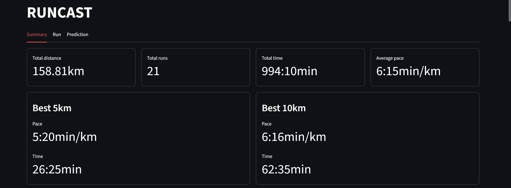
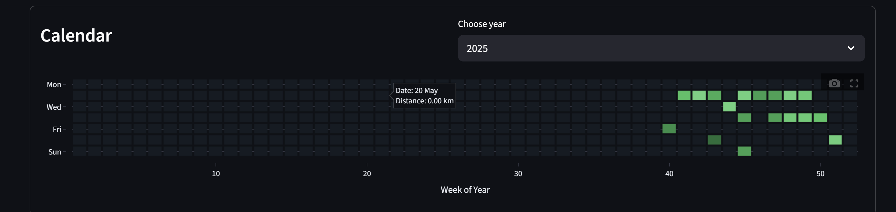
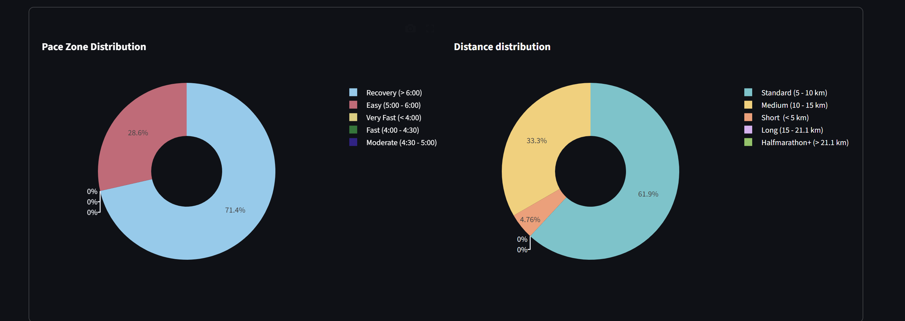
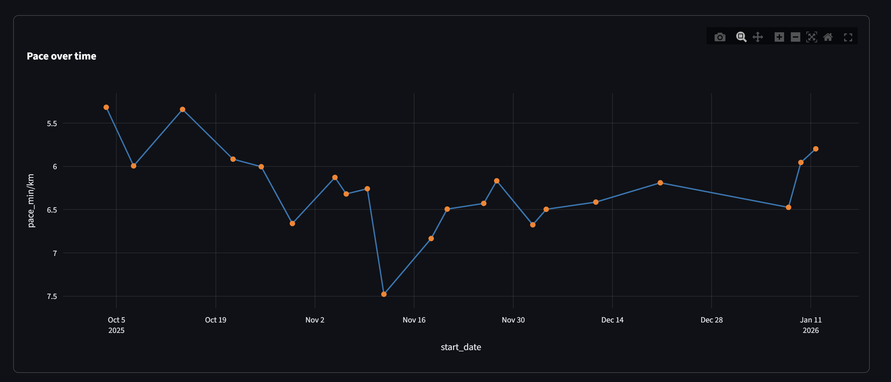
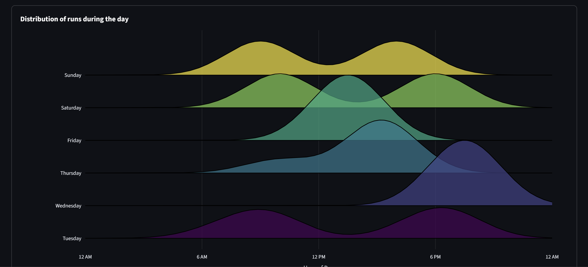
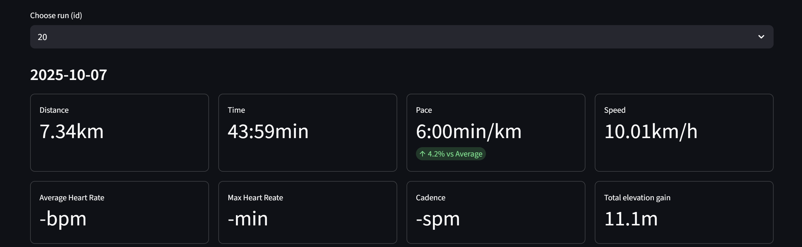
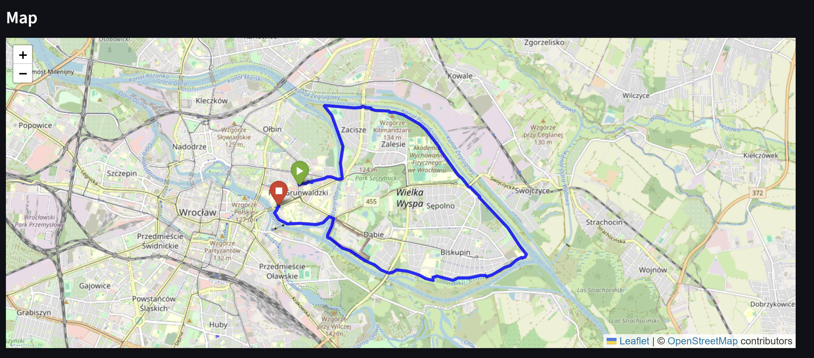
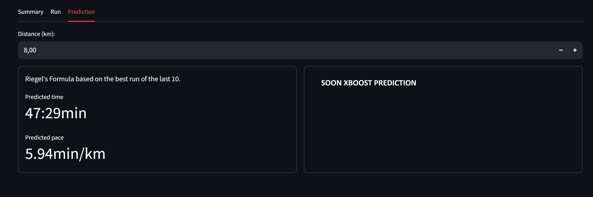

# RunCast 

**RunCast** is an intelligent running dashboard that integrates Strava data with advanced ML analytics.

## Key Features

RunCast offers automated synchronization with Strava through direct API integration, enabling the retrieval of recent activities and the conversion of raw JSON data into clean, analyzed CSV datasets with built-in outlier filtering. The platform provides performance analytics through interactive visualizations, including pace trends, distribution analyses, and a GitHub-style activity heatmap, along with fully interactive GPS maps generated using Folium and polyline decoding. Additionally, RunCast includes an AI-based performance prediction module that compares results with the classic Riegel formula and is designed to incorporate machine learning models such as XGBoost regression #BETA and kNN-based #BETA similarity analysis to improve prediction accuracy, particularly for users with limited historical data.


## Project Structure

```text
runcast/
├── .env                    # Strava API Keys
├── .gitignore              
├── requirements.txt        # Python dependencies
├── dashboard/              # User Interface (Streamlit)
│   └── main.py             # Main entry point for the dashboard
├── src/                    # Core 
│   ├── model.py            # ML Logic BETA!!
│   ├── map.py              # GPS mapping logic
│   ├── plots.py            # Visualization logic 
│   ├── fetch_activities.py # Strava API pipeline
│   ├── riegel.py           # Mathematical formula
│   └── scripts.py          # Helper functions
├── models/                
│   └── xgb_running_model.joblib
├── data/                   # Data storage
│   ├── personal/           # Personal Strava data
│   │   ├── raw/            # Raw data fetched from Strava API (JSON)
│   │   └── processed/      # Cleaned and processed data (CSV)
│   └── public/             # Public datasets
└── notebooks/              # Jupyter Notebooks
```

##  How to Run

### 1. Environment Setup
To sync with Strava, you need to provide your API credentials. Create a `.env` file in the **root folder** and paste your data:

```text
CLIENT_ID=your_strava_client_id
CLIENT_SECRET=your_strava_client_secret
STRAVA_REFRESH_TOKEN=your_strava_refresh_token
STRAVA_ACCESS_TOKEN=your_strava_access_token
STRAVA_REDIRECT_URI=your_strava_redirect_uri
STRAVA_EXPIRES_AT=your_strava_expires_at

```

### 2. Installation 

```text
pip install -r requirements.txt
```

### 3. Launch the Dashboard

Run the application from the root directory of the project using the following command:

1. To download data:
```text
python src/fetch_activities.py
```

2. To run dashboard:
```text
streamlit run dashboard/main.py
```

## Technical Stack

* **Streamlit** 
* **Folium & Streamlit-Folium** 
* **XGBoost** 
* **Scikit-Learn** 
* **Joblib**
* **Pandas** 
* **NumPy** 
* **Plotly & Ridgeplot** 
* **Stravalib** 
* **Python-Dotenv** 
* **Pathlib** 

## SCREENSHOTS

### SUMMARY


### PLOTS






### SELECTED RUN STATS AND MAP




### PREDICTIONS

